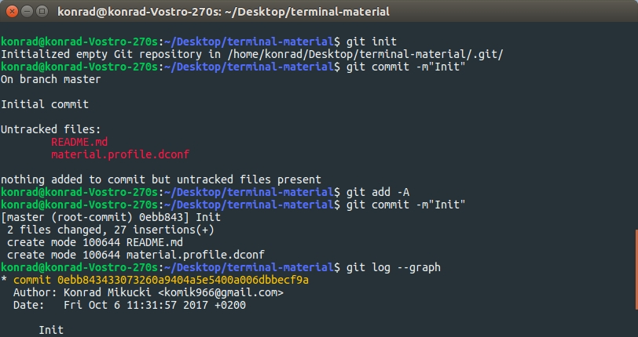

Material terminal color scheme
==============================


Installation
============
Ubuntu
---------
1. Open terminal
2. Go to Terminal -> Preferences
3. Go to tab "Profiles"
4. Create new profile named "material", copy its uuid
5. Run in terminal `dconf load /org/gnome/terminal/legacy/profiles:/:<COPIED_UUID>/ < material.profile.dconf`
  
   Example: 
   ```bash
   dconf load /org/gnome/terminal/legacy/profiles:/:fc55dd36-92a0-495e-974d-f826018081ce/ < material.profile.dconf
   ```
   
6. Switch terminal to the "material" profile and set it as default if you prefer.

macOS
---------
1. Open terminal
2. Go to Preferences (cmd + ,)
3. Go to tab "Profiles"
4. Import profile file (`Material.terminal`)
